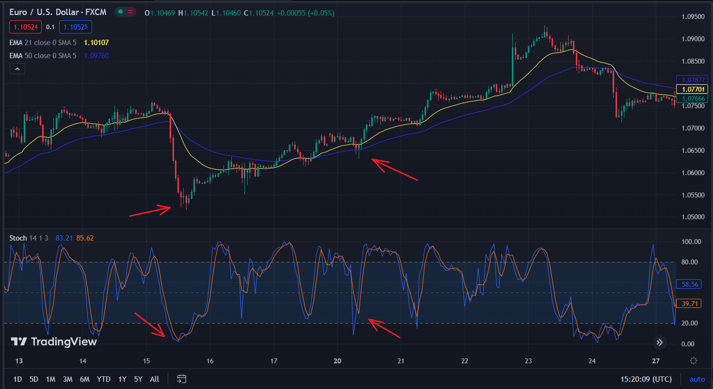
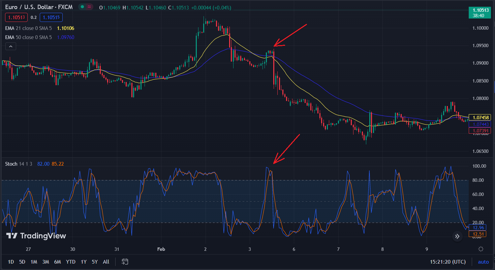

# Tg Bot for trading signals Stochastic

There are a lot of trading strategies using technical indicators, like MACD, Stochastic, Bollinger Bands, EMA etc. But whatever strategy you use, it's really exhausting to check all the currencies on market looking for good situation for you manually.

I've made this bot for automatic searching buy and sell signals using Stochastic indicator. It used for finding situations like below:

Buy:


Sell:

## General Info

This bot calculates indicators values for the last 3 month (it needed for getting precise values) using data from YFinanace API. It checks all currencies, crypto, futures and stocks you need every hour and send you in telegram message with currency pair and signal for buying or selling it. It's not perfect, so you need at least learn how this strategy works and look at the chart to see how really good signal is, check support and resistance levels etc.
## Strategy Explanation

The strategy use Stochastic indicator, 21-period EMA and 50-period EMA. When Stochastic line (blue) crosses a Stochastic MA (red) and its value is less than 20, it's a signal for buying. And when Stochastic line crosses a Stochastic MA when it value is more than 80, then it's sell. But only Stochastic can't give good signals. We also need to define a trend. SoFor this we use a 21 EMA (yellow) and 50 EMA (blue), which will help us to define a trend direction. So, if Stochastic crosses its MA below 20 and 21-EMA is above 50-ema, only than it will be a signal. And opposite for selling.
## Technologies

- numpy==1.24.2
- pandas==2.0.0
- pyTelegramBotAPI==4.10.0
- yfinance==0.2.14
## Running the project

At first, you should have installed Python on your computer. Not necessary, but advised to create a virtual environment, so you store your projects dependecies apart for avoiding conflicts beetwen packages.
```shell
pip install virtualenv
```
Clone this repository and open it in any text editor. To create virtualenv, run the command below in a Windows terminal:
```shell
python -m venv venv
```
or if you're on Linux or Mac:
```shell
virtualenv env
```
To activate virtualenv, run
```shell
venv\Scripts\activate.bat
```
Linux or Mac
```shell
source env/bin/active
```
Than install project dependencies
```shell
pip install -r requirements.txt
```
It is presumed that you have obtained an [API token with @BotFather](https://core.telegram.org/bots#botfather)

Now put your token in config.py file in variable 'TOKEN'. And put your message id in 'CHAT_ID'.

Then you can now run file 'trade_bot.py'. If you've done everything good, you'll receive a message from bot: 'Bot is now running. To see available commands: /help'.